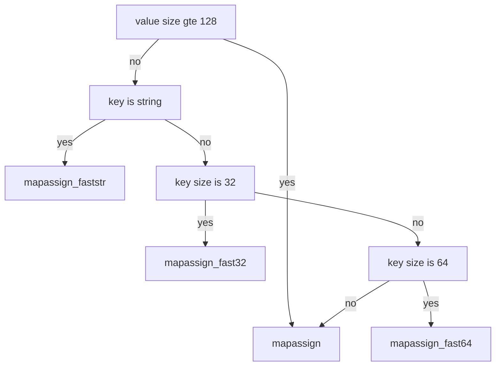

> 本文是在学习了曹大和draveness的文章后加入了少量自己的理解，学习为主，如果您发现文章观点错误，请在评论中不吝赐教。

------

## 08.map实现分析
**注：本文是在看了曹大的文章后进行的一点自己的分析或是后期准备分析的东西，其中我自己在代码中的备注均是以【me：】开头的曹大的文章在此————[map](https://github.com/cch123/golang-notes/blob/master/map.md)**
首先是map的结构图，由于原文章中是用符号画的，我实在弄不出来，大家直接看文章吧:
[map 源码分析](https://github.com/cch123/golang-notes/blob/master/map.md)
map的关键数据结构如下：

```go
const (
    // 一个 bucket 最多能放的元素数
    bucketCntBits = 3
    bucketCnt     = 1 << bucketCntBits

    // load factor = 13/2
    loadFactorNum = 13
    loadFactorDen = 2

    // 超过这两个 size 的对应对象，会被转为指针
    // TODO：那数据存储在哪里？
    maxKeySize   = 128
    maxValueSize = 128

    // data offset should be the size of the bmap struct, but needs to be
    // aligned correctly. For amd64p32 this means 64-bit alignment
    // even though pointers are 32 bit.
    dataOffset = unsafe.Offsetof(struct {
        b bmap
        v int64
    }{}.v)

    // tophash 除了放正常的高 8 位的 hash 值
    // 还会在空闲、迁移时存储一些特征的状态值
    // 所以合法的 tophash(指计算出来的那种)，最小也应该是 4
    // 小于 4 的表示的都是我们自己定义的状态值
    // me：这里的值可以理解成高8位哈希值的【其他用户】的数值，目前1.17中minTopHash变成了5；把empty拆分成了emptyReset和emptyOne两个值，分别为0和1
    empty          = 0 // cell is empty
    evacuatedEmpty = 1 // cell is empty, bucket is evacuated.
    evacuatedX     = 2 // key/value is valid.  Entry has been evacuated to first half of larger table.
    evacuatedY     = 3 // same as above, but evacuated to second half of larger table.
    minTopHash     = 4 // minimum tophash for a normal filled cell.

    // flags
    iterator     = 1 // there may be an iterator using buckets
    oldIterator  = 2 // there may be an iterator using oldbuckets
    hashWriting  = 4 // a goroutine is writing to the map
    sameSizeGrow = 8 // the current map growth is to a new map of the same size

    // sentinel bucket ID for iterator checks
    noCheck = 1<<(8*sys.PtrSize) - 1
)

// A header for a Go map.
type hmap struct {
    count     int // map 中的元素个数，必须放在 struct 的第一个位置，因为 内置的 len 函数会从这里读取
    flags     uint8
    // me: 这个B的意思是buckets的个数取对数就是B的个数，那么就是说一共有2^B个bucket，每个bucket又可以最多
    // 容纳8个元素，所以loadFactor*2^B就是最大key数量了，可以理解
    // 那么为什么要使用这种方法来表示bucket的数量呢？这是为了后面在计算kv属于哪个bucket提供方便；在计算完hash值后
    // 我们需要对hash值的后B位进行BitMask计算从而知道它是属于哪个bucket
    B         uint8  // log_2 of # of buckets (最多可以放 loadFactor * 2^B 个元素，再多就要 hashGrow 了)
    noverflow uint16 // overflow 的 bucket 的近似数
    hash0     uint32 // hash seed

    buckets    unsafe.Pointer // 2^B 大小的数组，如果 count == 0 的话，可能是 nil；看文章中的图，一定会秒懂
    oldbuckets unsafe.Pointer // 一半大小的之前的 bucket 数组，只有在 growing 过程中是非 nil
    nevacuate  uintptr        // progress counter for evacuation (buckets less than this have been evacuated)

    extra *mapextra // 当 key 和 value 都可以 inline 的时候，就会用这个字段
}

type mapextra struct {
    // 如果 key 和 value 都不包含指针，并且可以被 inline(<=128 字节)
    // 使用 extra 来存储 每个bucket的overflow bucket，这样可以避免 GC 扫描整个 map(因为key和value都没有指针了，肯定不会产生GC)
    // 然而 bmap.overflow 也是个指针(还是会被GC扫描)。这时候我们只能把这些 overflow 的指针
    // 都放在 hmap.extra.overflow 和 hmap.extra.oldoverflow 中了(这样就可以进行小范围的GC扫描)
    // overflow 包含的是 hmap.buckets 的 overflow 的 bucket
    // oldoverflow 包含扩容时的 hmap.oldbuckets 的 overflow 的 bucket
    overflow    *[]*bmap
    oldoverflow *[]*bmap

    // 指向空闲的 overflow bucket 的指针
    // 这里应该是提前申请的一个bmap，留着后面想用就用的。
    nextOverflow *bmap
}

// bucket 本体
type bmap struct {
    // tophash 是 hash 值的高 8 位
    tophash [bucketCnt]uint8
    // keys
    // values
    // overflow pointer
}
```

在初始化map时，编译器会根据你在创建map时指定的capacity来决定是使用makemap_smal创建小的map还是使用makemap创建大的map；如果在创建map时没有指定capacity，则使用makemap_small创建小map； 

```go
// make(map[k]v, hint)
// 如果编译器认为 map 和第一个 bucket 可以直接创建在栈上，h 和 bucket 可能都是非空
// 上面这句话的意思是如果编译器认为map可以创建在堆栈上，那h肯定早就创建好了，那么调用makemap时第三个参数就一定
// 是空的，
// h != nil，可以直接在 h 内创建 map
// 如果 h.buckets != nil，其指向的 bucket 可以作为第一个 bucket 来使用
func makemap(t *maptype, hint int, h *hmap) *hmap {
    // 在 64 位系统上 hmap 结构体大小为 48 字节
    // 32 位系统上是 28 字节
    if sz := unsafe.Sizeof(hmap{}); sz != 8+5*sys.PtrSize {
        println("runtime: sizeof(hmap) =", sz, ", t.hmap.size =", t.hmap.size)
        throw("bad hmap size")
    }

    if hint < 0 || hint > int(maxSliceCap(t.bucket.size)) {
        hint = 0
    }

    // 初始化 hmap，判断h是否为nil，这里就是函数开头注释说明的，可能这个h是在栈上已经创建了
    if h == nil {
        h = (*hmap)(newobject(t.hmap))
    }
    h.hash0 = fastrand()

    // 按照提供的元素个数，找一个可以放得下这么多元素的 B 值
    B := uint8(0)
    for overLoadFactor(hint, B) {
        B++
    }
    h.B = B

    // 分配初始的 hash table
    // 如果 B == 0，buckets 字段会由 mapassign 来 lazily 分配
    // 因为如果 hint 很大的话，对这部分内存归零会花比较长时间
    if h.B != 0 {
        var nextOverflow *bmap
        h.buckets, nextOverflow = makeBucketArray(t, h.B)
        if nextOverflow != nil {
            h.extra = new(mapextra)
            h.extra.nextOverflow = nextOverflow
        }
    }

    return h
}
```

当然有的时候，使用make创建map时没有真正地使用makemap，如下所示：

```go
package main

func main() {
	var m = make(map[int]int, 4)
	m[1] = 1
}
```

你看不到真正的makemap或者makemap_small函数，这里我盲猜是因为堆栈上创建并且较小，所以没有使用这个函数，[**TODO**]这里具体的原因我们以后有机会再仔细考虑。
make map的语法分析是在`cmd/compile/internal/gc/walk.go:1192`中，相关代码如下，简单看一下就好：

```go
	case OMAKEMAP:
		t := n.Type
		hmapType := hmap(t)
		hint := n.Left
```

我们在进行元素访问的时候，首先是对元素进行hash计算；这里应该有一个图，但是由于贴进来效果很差，所以想看就直接去本节中提到的那个md去看；
访问的逻辑如下：
1. 对key进行hash运算后，取hash值的后B位(B是hmap中的一个数据成员)做bucketMask掩码计算得到其所在的bucket；
2. 知道了所在的bucket后，我们再获取hash值的高8为作为tophash去bmap结果中查找相关的元素及对应的value值；

上面是大致的数据访问原理，那么其实具体的函数有mapaccess1，mapaccess2和mapaccessK以及他们的变种(需要说明的是后缀的fst32，fast4，faststr这些指的都是key的长度，根据key的长度来使用不用的mapacces函数)：
1. mapaccess1_fast32, mapaccess1_fast64, mapaccess1_faststr;
2. mapaccess2_fast32, mapaccess2_fast64, mapaccess2_faststr(*我比较感兴趣的是这样特殊的access函数具体有哪里的不同，后期回来看*);
具体选择哪一种是由编译器在编译器决定的；
相关的访问代码如下：

```go
func mapaccess2(t *maptype, h *hmap, key unsafe.Pointer) (unsafe.Pointer, bool) {
    // map 为空，或者元素数为 0，直接返回未找到
    if h == nil || h.count == 0 {
        return unsafe.Pointer(&zeroVal[0]), false
    }
    // 这个hashWriting用来做并发检查使用的
    if h.flags&hashWriting != 0 {
        throw("concurrent map read and map write")
    }
    alg := t.key.alg
    // 不同类型的 key，所用的 hash 算法是不一样的
    // 具体可以参考 algarray
    hash := alg.hash(key, uintptr(h.hash0))
    // 如果 B = 3，那么结果用二进制表示就是 111
    // 如果 B = 4，那么结果用二进制表示就是 1111
    m := bucketMask(h.B)
    // 按位 &，可以 select 出对应的 bucket
    // me: 为什么将t.bucketsize转换成uintptr我似乎有了一些理解：uintptr的官方解释为：
    // uintptr is an integer type that is large enough to hold the bit pattern of any pointer.
    // 其实就是表示可以容纳指针的长度，我们知道指针其实就是地址，内存中表示的也是地址，而地址也是一个byte一个byte
    // 添加的；其实我们就可以理解成是内存中每一个byte的地址表示；就是将数据长度转换成【地址表示】，
    // 因为这相当于是在地址上进行加减，uintptr其实就是表示的是地址值以及地址delta值
    b := (*bmap)(unsafe.Pointer(uintptr(h.buckets) + (hash&m)*uintptr(t.bucketsize)))
    // 会用到 h.oldbuckets 时，说明 map 发生了扩容
    // 这时候，新的 buckets 里可能还没有老的内容
    // 所以一定要在老的里面找，否则有可能发生“消失”的诡异现象
    //
    // me: 在rehash阶段，使用evacuate函数会对整个bucket进行迁移，如果当前这个bucket是没有迁移的，
    // 那么一定是在老bucket中，仅需要去老bucket中查找
    if c := h.oldbuckets; c != nil {
        if !h.sameSizeGrow() { // me: 如果不是等尺寸扩大，那么一定是成倍扩大
            // 说明之前只有一半的 bucket，需要除 2
            m >>= 1
        }
        oldb := (*bmap)(unsafe.Pointer(uintptr(c) + (hash&m)*uintptr(t.bucketsize)))
        if !evacuated(oldb) { 
            // 该bucket还没有完成数据转移，说明数据没有在新的bucket中，
            // 需要使用老的bucket
            b = oldb
        }
    }
    // tophash 取其高 8bit 的值
    top := tophash(hash)
    for ; b != nil; b = b.overflow(t) {
        // 一个 bucket 在存储满 8 个元素后，就再也放不下了
        // 这时候会创建新的 bucket
        // 挂在原来的 bucket 的 overflow 指针成员上
        for i := uintptr(0); i < bucketCnt; i++ {
            // 循环对比 bucket 中的 tophash 数组
            // 如果找到了相等的 tophash，那说明就是这个 bucket 了
            if b.tophash[i] != top {
                continue
            }
            k := add(unsafe.Pointer(b), dataOffset+i*uintptr(t.keysize))
            if t.indirectkey {
                // me: 我们知道，如果key和value大于128个字段时或者不是inline时，会将数据存储在其他地方，
                // 而key和value就是一个指针，此处就是继续这样的处理
                // 另外，感觉golang的源代码中，更喜欢将较异常的情况放在后面以if的形式存在；看到过很多次，包括
                // 上面的evacuated函数
                k = *((*unsafe.Pointer)(k))
            }
            if alg.equal(key, k) {
                // 这里的计算方式表如果key和value是内联的，则说明它的长度是固定的，都是128字节；
                v := add(unsafe.Pointer(b), dataOffset+bucketCnt*uintptr(t.keysize)+i*uintptr(t.valuesize))
                if t.indirectvalue {
                    v = *((*unsafe.Pointer)(v))
                }
                return v, true
            }
        }
    }

    // 所有 bucket 都没有找到，返回零值和 false
    return unsafe.Pointer(&zeroVal[0]), false
}
```

说完了读取，在说一下赋值，其实赋值也有几种方式，也是有编译器在编译器判断使用的，具体的逻辑是：
1. 首先判断key的类型是否是string
2. 如果不是string，那么根据key类型的大小做选择；

上面这个代码其实是早期的go版本代码，现在这个代码中包含了**raceenable**字段，是用于竞态检测的；go的build和run命令支持选项-race。如果启用该选项，发现存在数据竞态就会报警。-race在源码中对应的变量是raceenabled，当启用-race，raceenabled就是true。在mapaccess中其实就可以看到相关的数据竞态检查：

```go

if raceenabled && h != nil {
    callerpc := getcallerpc()
    racereadpc(unsafe.Pointer(h), callerpc, funcPC(mapaccess2_faststr))
}

```

具体竞态检测后面可以参照一下这两篇文章[Go 译文之竞态检测器 race](https://segmentfault.com/a/1190000020107431)和[
为什么go的map数据竞争是fatal错误, 而不是panic?](https://www.zhihu.com/question/305845656)

具体流程图如下：



这几个assign函数都是大同小异，拿其中一个即可：

```go

// 和 mapaccess 函数差不多，但在没有找到 key 时，会为 key 分配一个新的槽位
func mapassign(t *maptype, h *hmap, key unsafe.Pointer) unsafe.Pointer {
    if h == nil {
        // nil map 不能进行赋值操作
        panic(plainError("assignment to entry in nil map"))
    }
    // 竞态检查，如果有其他goroutine写数据，也会将hashWriting标记位置成1，那么这里就会报错
    if h.flags&hashWriting != 0 {
        throw("concurrent map writes")
    }

    // 调用对应类型的 hash 算法
    alg := t.key.alg
    hash := alg.hash(key, uintptr(h.hash0))

    // 调用 alg.hash后再设置hashWriting的flag，因为alg.hash可能会panic
    // 这时候我们实际上还没有处理一个map write的操作。
    // 将flag的hashWriting置成1
    h.flags |= hashWriting

    if h.buckets == nil {
        // 分配第一个 buckt
        h.buckets = newobject(t.bucket) // newarray(t.bucket, 1)
    }

again:
    // 计算低 8 位 hash，根据计算出的 bucketMask 选择对应的 bucket
    // mask : 1111111
    bucket := hash & bucketMask(h.B)
    if h.growing() {
        growWork(t, h, bucket)
    }
    // 计算出存储的 bucket 的内存位置
    // pos = start + bucketNumber * bucetsize
    // 这里的命名不太好，bucket 其实是 bucketNumber
    b := (*bmap)(unsafe.Pointer(uintptr(h.buckets) + bucket*uintptr(t.bucketsize)))
    // 计算高 8 位 hash
    top := tophash(hash)

    var inserti *uint8
    var insertk unsafe.Pointer
    var val unsafe.Pointer
    for {
        // me: bucket可以理解成一个常量8
        // bucketCntBits = 3
        // bucketCnt     = 1 << bucketCntBits
        for i := uintptr(0); i < bucketCnt; i++ {
            // 遍历 8 个 bucket 中的元素
            // 这里的 bucketCnt 是全局常量
            // 其实叫 bucketElemCnt 更合适
            if b.tophash[i] != top {
                // 在 b.tophash[i] != top 的情况下
                // 理论上有可能会是一个空槽位
                // 一般情况下 map 的槽位分布是这样的，e 表示 empty:
                // [h1][h2][h3][h4][h5][e][e][e]
                // 但在执行过 delete 操作时，可能会变成这样:
                // [h1][h2][e][e][h5][e][e][e]
                // 所以如果再插入的话，会尽量往前面的位置插
                // [h1][h2][e][e][h5][e][e][e]
                //          ^
                //          ^
                //       这个位置
                // 所以在循环的时候还要顺便把前面的空位置先记下来
                // me：留着后续如果没有找到相关已经存在的key时，用这个来插入
                if b.tophash[i] == empty && inserti == nil {
                    // 如果这个槽位没有被占，说明可以往这里塞 key 和 value
                    inserti = &b.tophash[i] // tophash 的插入位置
                    insertk = add(unsafe.Pointer(b), dataOffset+i*uintptr(t.keysize))
                    val = add(unsafe.Pointer(b), dataOffset+bucketCnt*uintptr(t.keysize)+i*uintptr(t.valuesize))
                }
                continue
            }
            // me：如果程序走到这里，则说明要插入的key和当前tophash值相同
            // b是一个指针，下面k是通过地址运算而获取到的地址值
            k := add(unsafe.Pointer(b), dataOffset+i*uintptr(t.keysize))
            if t.indirectkey {
                // me:这里稍微有一点绕，首先b是一个bmap类型的指针，那么我们通过add函数获取到的k其实也是一个指针，它指向了key所在的位置，如果key自身是一个指针类型，那么当前k值其实就不是指向key的unsafe.Pointer，而是指向【指向key的unsafe.Pointer】的指针，因此我们需要先将k转成【*unsafe.Pointer】类型后再解引用，就变成了指向Key的unsafe.Pointer类型了
                k = *((*unsafe.Pointer)(k))
            }
            // 如果相同的 hash 位置的 key 和要插入的 key 字面上不相等
            // 如果两个 key 的首八位后最后八位哈希值一样，就会进行其值比较
            // 算是一种哈希碰撞吧
            if !alg.equal(key, k) {
                continue
            }
            // 对应的位置已经有 key 了，直接更新就行
            if t.needkeyupdate {
                typedmemmove(t.key, k, key)
            }
            val = add(unsafe.Pointer(b), dataOffset+bucketCnt*uintptr(t.keysize)+i*uintptr(t.valuesize))
            goto done
        }
        // bucket 的 8 个槽没有满足条件的能插入或者能更新的，去 overflow 里继续找
        ovf := b.overflow(t)
        // 如果 overflow 为 nil，说明到了 overflow 链表的末端了
        if ovf == nil {
            break
        }
        // 赋值为链表的下一个元素，继续循环
        b = ovf
    }

    // 没有找到 key，分配新的空间
    // me: 这里个人觉得应该是没有找到key，那么就分配空间或者是尝试在之前的empty的位置插入

    // 如果触发了最大的 load factor，或者已经有太多 overflow buckets(me: 虽然没有达到load factor，但是由于大量写、删除操作，导致空槽较多浪费空间)
    // 并且这个时刻没有在进行 growing 的途中，那么就开始 growing
    if !h.growing() && (overLoadFactor(h.count+1, h.B) || tooManyOverflowBuckets(h.noverflow, h.B)) {
        hashGrow(t, h)
        // hashGrow 的时候会把当前的 bucket 放到 oldbucket 里
        // 但还没有开始分配新的 bucket，所以需要到 again 重试一次
        // 重试的时候在 growWork 里会把这个 key 的 bucket 优先分配好
        goto again // Growing the table invalidates everything, so try again
    }

    if inserti == nil {
        // 前面在桶里找的时候，没有找到能塞这个 tophash 的位置
        // 说明当前所有 buckets 都是满的，分配一个新的 bucket
        newb := h.newoverflow(t, b)
        inserti = &newb.tophash[0]
        insertk = add(unsafe.Pointer(newb), dataOffset)
        val = add(insertk, bucketCnt*uintptr(t.keysize))
    }

    // 把新的 key 和 value 存储到应插入的位置
    if t.indirectkey {
        kmem := newobject(t.key)
        *(*unsafe.Pointer)(insertk) = kmem
        insertk = kmem
    }
    if t.indirectvalue {
        vmem := newobject(t.elem)
        *(*unsafe.Pointer)(val) = vmem
    }
    typedmemmove(t.key, insertk, key)
    *inserti = top
    h.count++

done:
    // me: 这里也是做了一个竞态检查，我们在之前已经将hashWring的标志位置成了1，此时如果为0一定会报错，那么这个函数在开头
    // 判断hashWriting，然后将hashWriting置为1，最后再判断hashWriting是否为0，那么只有整个流程中没有其他goroutine进入
    // 才不会报错，否则就会直接throw后退出
    if h.flags&hashWriting == 0 {
        throw("concurrent map writes")
    }
    h.flags &^= hashWriting
    if t.indirectvalue {
        val = *((*unsafe.Pointer)(val))
    }
    return val
}

```

~~之前没有太看懂这个函数，这个函数应该是根据key，分配出val的地址，后续将key的值拷贝到该内存，从go1.17的代码中可以发现用法~~
(下面的代码此时也应该是删除状态的，但是因为我还是不懂这个函数什么时候会使用，所以先放到这里吧。。。)：

```go

//go:linkname reflect_mapassign reflect.mapassign
func reflect_mapassign(t *maptype, h *hmap, key unsafe.Pointer, elem unsafe.Pointer) {
	p := mapassign(t, h, key)
	typedmemmove(t.elem, p, elem)
}

```

从上述代码中的`typedmemmove`就是看出，我们暗道key对应的额val位置后，在使用mememove进行夫复制。

那么具体是怎么复制的呢？其实赋值是在编译器实现的，我们随便写一个代码，并且查看它的汇编: 

```go

package main
import "fmt"
func main() {
    m := make(map[int]string)
    m[0] = "88"
    fmt.Println(m[0])
}

```

相关的汇编代码如下：

```
# 调用函数mapassign_fast64之后，有三个参数和一个返回值，那么24(SP)这里应该就是返回值的地址，
# 该代码的最后MOVQ AX, (DI)就是将AX的值赋给*DI
0x00e0 00224 (main.go:7)   CALL    runtime.mapassign_fast64(SB)
0x00e5 00229 (main.go:7)    PCDATA  $0, $1
0x00e5 00229 (main.go:7)    MOVQ    24(SP), DI
0x00ea 00234 (main.go:7)    MOVQ    DI, ""..autotmp_5+72(SP)
0x00ef 00239 (main.go:7)    TESTB   AL, (DI)
0x00f1 00241 (main.go:7)    MOVQ    $2, 8(DI)
0x00f9 00249 (main.go:7)    PCDATA  $0, $-2
0x00f9 00249 (main.go:7)    PCDATA  $1, $-2
0x00f9 00249 (main.go:7)    CMPL    runtime.writeBarrier(SB), $0
0x0100 00256 (main.go:7)    JEQ 263
0x0102 00258 (main.go:7)    JMP 474
0x0107 00263 (main.go:7)    LEAQ    go.string."88"(SB), AX
0x010e 00270 (main.go:7)    MOVQ    AX, (DI)
```

上面涉及到了两个我感兴趣的函数，一个是growing，一个是其相关的growWork和其内部的**evacuate**函数
判断该map是否是正在扩张的状态

```go
// growing reports whether h is growing. The growth may be to the same size or bigger.
func (h *hmap) growing() bool {
    return h.oldbuckets != nil
}
```

growWork的相关函数：

```go

func growWork(t *maptype, h *hmap, bucket uintptr) {
    // make sure we evacuate the oldbucket corresponding
    // to the bucket we're about to use
    // me: evacuate函数一次处理一个bucket及其相关的overflow bucket
    evacuate(t, h, bucket&h.oldbucketmask())
    // evacuate one more oldbucket to make progress on growing
    if h.growing() {
        evacuate(t, h, h.nevacuate)
    }
}

```

相关dataOffSet计算方法，个人觉得比较精妙：

```go

dataOffset = unsafe.Offsetof(struct {
    b bmap
    v int64
}{}.v)

```

目前有一个小问题，就是在看到bmap并不是像我们在[博客](https://github.com/cch123/golang-notes/blob/master/map.md)中看到的是有很多数据成员的，它其实只有一个tophash成员，那它是如何完成数据申请的呢？我后面需要研究一下：

```go

// A bucket for a Go map.
type bmap struct {
    // tophash generally contains the top byte of the hash value
    // for each key in this bucket. If tophash[0] < minTopHash,
    // tophash[0] is a bucket evacuation state instead.
    tophash [bucketCnt]uint8
    // Followed by bucketCnt keys and then bucketCnt elems.
    // NOTE: packing all the keys together and then all the elems together makes the
    // code a bit more complicated than alternating key/elem/key/elem/... but it allows
    // us to eliminate padding which would be needed for, e.g., map[int64]int8.
    // Followed by an overflow pointer.
}

```

~~**应该是在makemap函数中调用的makeBucketArray函数中完成的**。~~
真正的原理应该如下(参照文章——————[3.3 哈希表](https://draveness.me/golang/docs/part2-foundation/ch03-datastructure/golang-hashmap/#332-%E6%95%B0%E6%8D%AE%E7%BB%93%E6%9E%84))：

这个bmap是go源代码中的结构，在运行期间，runtime.bmap 结构体其实不止包含 tophash 字段，因为哈希表中可能存储不同类型的键值对，而且 Go 语言也不支持泛型，所以键值对占据的内存空间大小只能在编译时进行推导。runtime.bmap 中的其他字段在运行时也都是通过计算内存地址的方式访问的，所以它的定义中就不包含这些字段，不过我们能根据编译期间的 cmd/compile/internal/gc.bmap中推断出该map的结构（注：随着go版本的升级，现在负责这个转换功能的是在函数MapBucketType）

```go

type bmap struct {
    topbits  [8]uint8
    keys     [8]keytype
    values   [8]valuetype
    pad      uintptr
    overflow uintptr
}

```

并且在编译器我们创建了maptype(type.go)而其中包含各种结构：

```go

// Needs to be in sync with ../cmd/link/internal/ld/decodesym.go:/^func.commonsize,
// ../cmd/compile/internal/reflectdata/reflect.go:/^func.dcommontype and
// ../reflect/type.go:/^type.rtype.
// ../internal/reflectlite/type.go:/^type.rtype.
type _type struct {
    size       uintptr
    ptrdata    uintptr // size of memory prefix holding all pointers
    hash       uint32
    tflag      tflag
    align      uint8
    fieldAlign uint8
    kind       uint8
    // function for comparing objects of this type
    // (ptr to object A, ptr to object B) -> ==?
    equal func(unsafe.Pointer, unsafe.Pointer) bool
    // gcdata stores the GC type data for the garbage collector.
    // If the KindGCProg bit is set in kind, gcdata is a GC program.
    // Otherwise it is a ptrmask bitmap. See mbitmap.go for details.
    gcdata    *byte
    str       nameOff
    ptrToThis typeOff
}

type maptype struct {
    typ    _type
    key    *_type
    elem   *_type
    bucket *_type // internal type representing a hash bucket
    // function for hashing keys (ptr to key, seed) -> hash
    hasher     func(unsafe.Pointer, uintptr) uintptr
    keysize    uint8  // size of key slot
    elemsize   uint8  // size of elem slot
    bucketsize uint16 // size of bucket
    flags      uint32
}

```

删除相关的代码如下：

```go

func mapdelete(t *maptype, h *hmap, key unsafe.Pointer) {
    if h == nil || h.count == 0 {
        return
    }
    if h.flags&hashWriting != 0 {
        throw("concurrent map writes")
    }

    alg := t.key.alg
    hash := alg.hash(key, uintptr(h.hash0))

    // 调用 alg.hash 设置 hashWriting 的 flag，因为 alg.hash 可能会 panic
    // 这时候我们没法完成一次写操作
    h.flags |= hashWriting

    // 按低 8 位 hash 值选择 bucket
    bucket := hash & bucketMask(h.B)
    if h.growing() {
        growWork(t, h, bucket)
    }
    // 按上面算出的桶的索引，找到 bucket 的内存地址
    // 并强制转换为需要的 bmap 结构
    b := (*bmap)(add(h.buckets, bucket*uintptr(t.bucketsize)))
    // 高 8 位 hash 值
    top := tophash(hash)
search:
    for ; b != nil; b = b.overflow(t) {
        for i := uintptr(0); i < bucketCnt; i++ {
            // 和上面的差不多，8 个槽位，分别对比 tophash
            // 没找到的话就去外围 for 循环的 overflow 链表中继续查找
            if b.tophash[i] != top {
                continue
            }

            // b.tophash[i] == top
            // 计算 k 所在的槽位的内存地址
            k := add(unsafe.Pointer(b), dataOffset+i*uintptr(t.keysize))
            k2 := k
            // 如果 key > 128 字节
            if t.indirectkey {
                k2 = *((*unsafe.Pointer)(k2))
            }

            // 当高 8 位哈希值相等时，还需要对具体值进行比较
            // 以避免哈希冲突时值覆盖
            if !alg.equal(key, k2) {
                continue
            }

            // 如果 key 中是指针，那么清空 key 的内容
            if t.indirectkey {
                *(*unsafe.Pointer)(k) = nil
            } else if t.key.kind&kindNoPointers == 0 {
                memclrHasPointers(k, t.key.size)
            }

            // 计算 value 所在的内存地址
            v := add(unsafe.Pointer(b), dataOffset+bucketCnt*uintptr(t.keysize)+i*uintptr(t.valuesize))
            // 和上面 key 的逻辑差不多
            if t.indirectvalue {
                *(*unsafe.Pointer)(v) = nil
            } else if t.elem.kind&kindNoPointers == 0 {
                memclrHasPointers(v, t.elem.size)
            } else {
                memclrNoHeapPointers(v, t.elem.size)
            }
            // 设置 tophash[i] = 0
            b.tophash[i] = empty
            // hmap 的大小计数 -1
            h.count--
            break search
        }
    }

    if h.flags&hashWriting == 0 {
        throw("concurrent map writes")
    }
    h.flags &^= hashWriting
}

```

**map不会自动的缩容，除非你把整个map删除掉。**

删掉相关代码如下：

```go

func mapdelete(t *maptype, h *hmap, key unsafe.Pointer) {
    if h == nil || h.count == 0 {
        return
    }
    if h.flags&hashWriting != 0 {
        throw("concurrent map writes")
    }

    alg := t.key.alg
    hash := alg.hash(key, uintptr(h.hash0))

    // 调用 alg.hash 设置 hashWriting 的 flag，因为 alg.hash 可能会 panic
    // 这时候我们没法完成一次写操作
    h.flags |= hashWriting

    // 按低 8 位 hash 值选择 bucket
    bucket := hash & bucketMask(h.B)
    // me: 此时的h.B已经是扩容后的数据了(通过hashGrow完成的)，如果还在扩容，则继续对未转换的部分进行
    // 移动处理。
    if h.growing() {
    // me: growWork中会通过bucket&h.oldbucketmask()来获取到原来的所在的bucket从而进行evacuate；
        growWork(t, h, bucket)
    }
    // 按上面算出的桶的索引，找到 bucket 的内存地址
    // 并强制转换为需要的 bmap 结构
    b := (*bmap)(add(h.buckets, bucket*uintptr(t.bucketsize)))
    // 高 8 位 hash 值
    top := tophash(hash)
search:
    for ; b != nil; b = b.overflow(t) {
        for i := uintptr(0); i < bucketCnt; i++ {
            // 和上面的差不多，8 个槽位，分别对比 tophash
            // 没找到的话就去外围 for 循环的 overflow 链表中继续查找
            if b.tophash[i] != top {
                continue
            }

            // b.tophash[i] == top
            // 计算 k 所在的槽位的内存地址
            k := add(unsafe.Pointer(b), dataOffset+i*uintptr(t.keysize))
            k2 := k
            // 如果 key > 128 字节
            if t.indirectkey {
                k2 = *((*unsafe.Pointer)(k2))
            }

            // 当高 8 位哈希值相等时，还需要对具体值进行比较
            // 以避免哈希冲突时值覆盖
            if !alg.equal(key, k2) {
                continue
            }

            // 如果 key 中是指针，那么清空 key 的内容
            if t.indirectkey {
                *(*unsafe.Pointer)(k) = nil
            } else if t.key.kind&kindNoPointers == 0 {
                memclrHasPointers(k, t.key.size)
            }

            // 计算 value 所在的内存地址
            v := add(unsafe.Pointer(b), dataOffset+bucketCnt*uintptr(t.keysize)+i*uintptr(t.valuesize))
            // 和上面 key 的逻辑差不多
            if t.indirectvalue {
                *(*unsafe.Pointer)(v) = nil
            } else if t.elem.kind&kindNoPointers == 0 {
                memclrHasPointers(v, t.elem.size)
            } else {
                memclrNoHeapPointers(v, t.elem.size)
            }
            // 设置 tophash[i] = 0
            b.tophash[i] = empty
            // hmap 的大小计数 -1
            h.count--
            break search
        }
    }

    if h.flags&hashWriting == 0 {
        throw("concurrent map writes")
    }
    h.flags &^= hashWriting
}

```

在map写过程(mapassign或mapdelete)中，如果map还是growing的状态，那我们会对相关的bucket进行进行元素扩散，那么相关的代码如下：

```go

func evacuate(t *maptype, h *hmap, oldbucket uintptr) {
    b := (*bmap)(add(h.oldbuckets, oldbucket*uintptr(t.bucketsize)))
    // me: newbit为rehash阶段对应的老bucket的个数
    newbit := h.noldbuckets()
    if !evacuated(b) {
        // TODO: reuse overflow buckets instead of using new ones, if there
        // is no iterator using the old buckets.  (If !oldIterator.)

        // xy 包含的是移动的目标
        // x 表示新 bucket 数组的前(low)半部分
        // y 表示新 bucket 数组的后(high)半部分
        var xy [2]evacDst
        x := &xy[0]
        x.b = (*bmap)(add(h.buckets, oldbucket*uintptr(t.bucketsize)))
        x.k = add(unsafe.Pointer(x.b), dataOffset)
        x.v = add(x.k, bucketCnt*uintptr(t.keysize))

        if !h.sameSizeGrow() {
            // 如果 map 大小(hmap.B)增大了，那么我们只计算 y
            // 否则 GC 可能会看到损坏的指针
            y := &xy[1]
            // me: 我们知道在rehash时如果是容量变大，那么原bucket会变成两个bucket，其中一个和老bucket值一样
            // 另外一个bucket值为【老bucket+老bucket总数】，老bucket总数即是newbit的值，这里可以举个例子看一下
            // 
            // 原bucket中有两个数据1和5(我们假定hash函数为f(n) = n)，原来的mask是0x11，
            // 那么做掩码操作后他们的位置都会落在bucketID为1的bucket中，此时扩容后mask会编程0x111，这样原来hash函数
            // 为5的元素就会落在bucketID为5的bucket中，由原来的bucketID为1移动到了bucketID为5的bucket中，就是因为
            // 扩容后的掩码比原来多了0x100(可以理解成0x111"减去"0x11得到的值)，而这个值就是newbit的值
            y.b = (*bmap)(add(h.buckets, (oldbucket+newbit)*uintptr(t.bucketsize)))
            y.k = add(unsafe.Pointer(y.b), dataOffset)
            y.v = add(y.k, bucketCnt*uintptr(t.keysize))
        }

        for ; b != nil; b = b.overflow(t) {
            k := add(unsafe.Pointer(b), dataOffset)
            v := add(k, bucketCnt*uintptr(t.keysize))
            for i := 0; i < bucketCnt; i, k, v = i+1, add(k, uintptr(t.keysize)), add(v, uintptr(t.valuesize)) {
                top := b.tophash[i]
                if top == empty {
                    b.tophash[i] = evacuatedEmpty
                    continue
                }
                if top < minTopHash {
                    throw("bad map state")
                }
                k2 := k
                if t.indirectkey {
                    k2 = *((*unsafe.Pointer)(k2))
                }
                var useY uint8
                if !h.sameSizeGrow() {
                    // 计算哈希，以判断我们的数据要转移到哪一部分的 bucket
                    // 可能是 x 部分，也可能是 y 部分
                    hash := t.key.alg.hash(k2, uintptr(h.hash0))
                    if h.flags&iterator != 0 && !t.reflexivekey && !t.key.alg.equal(k2, k2) {
                        // 为什么要加 reflexivekey 的判断，可以参考这里:
                        // https://go-review.googlesource.com/c/go/+/1480
                        // key != key，只有在 float 数的 NaN 时会出现
                        // 比如:
                        // n1 := math.NaN()
                        // n2 := math.NaN()
                        // fmt.Println(n1, n2)
                        // fmt.Println(n1 == n2)
                        // 这种情况下 n1 和 n2 的哈希值也完全不一样
                        // 这里官方表示这种情况是不可复现的
                        // 需要在 iterators 参与的情况下才能复现
                        // 但是对于这种 key 我们也可以随意对其目标进行发配
                        // 同时 tophash 对于 NaN 也没啥意义
                        // 还是按正常的情况下算一个随机的 tophash
                        // 然后公平地把这些 key 平均分布到各 bucket 就好
                        useY = top & 1 // 让这个 key 50% 概率去 Y 半区
                        top = tophash(hash)
                    } else {
                        // 这里写的比较 trick
                        // 比如当前有 8 个桶
                        // 那么如果 hash & 8 != 0
                        // 那么说明这个元素的 hash 这种形式
                        // xxx1xxx
                        // 而扩容后的 bucketMask 是
                        //    1111
                        // 所以实际上这个就是
                        // xxx1xxx & 1000 > 0
                        // 说明这个元素在扩容后一定会去下半区，即Y部分
                        // 所以就是 useY 了
                        if hash&newbit != 0 {
                            useY = 1
                        }
                    }
                }
   
                // me: 现在1.17版本中，该处代码逻辑又加了一个判断子条件
                // evacuatedX+1 != evacuatedY || evacuatedX^1 != evacuatedY
                // 但是这两个都是常量，因为感觉写在这里是怕后期修改代码无意修改到他从而产生严重影响
                if evacuatedX+1 != evacuatedY {
                    throw("bad evacuatedN")
                }

                b.tophash[i] = evacuatedX + useY // evacuatedX + 1 == evacuatedY
                dst := &xy[useY]                 // 移动目标

                if dst.i == bucketCnt {
                    dst.b = h.newoverflow(t, dst.b)
                    dst.i = 0
                    dst.k = add(unsafe.Pointer(dst.b), dataOffset)
                    dst.v = add(dst.k, bucketCnt*uintptr(t.keysize))
                }
                dst.b.tophash[dst.i&(bucketCnt-1)] = top // mask dst.i as an optimization, to avoid a bounds check
                if t.indirectkey {
                    *(*unsafe.Pointer)(dst.k) = k2 // 拷贝指针
                } else {
                    typedmemmove(t.key, dst.k, k) // 拷贝值
                }
                if t.indirectvalue {
                    *(*unsafe.Pointer)(dst.v) = *(*unsafe.Pointer)(v)
                } else {
                    typedmemmove(t.elem, dst.v, v)
                }
                // me: 循环利用了dst中的i成员，当原bucket的数据成员很多时，就使用溢出桶
                dst.i++
                // These updates might push these pointers past the end of the
                // key or value arrays.  That's ok, as we have the overflow pointer
                // at the end of the bucket to protect against pointing past the
                // end of the bucket.
                dst.k = add(dst.k, uintptr(t.keysize))
                dst.v = add(dst.v, uintptr(t.valuesize))
            }
        }
        // Unlink the overflow buckets & clear key/value to help GC.
        if h.flags&oldIterator == 0 && t.bucket.kind&kindNoPointers == 0 {
            b := add(h.oldbuckets, oldbucket*uintptr(t.bucketsize))
            // Preserve b.tophash because the evacuation
            // state is maintained there.
            ptr := add(b, dataOffset)
            n := uintptr(t.bucketsize) - dataOffset
            memclrHasPointers(ptr, n)
        }
    }

    if oldbucket == h.nevacuate {
        advanceEvacuationMark(h, t, newbit)
    }
}

```
