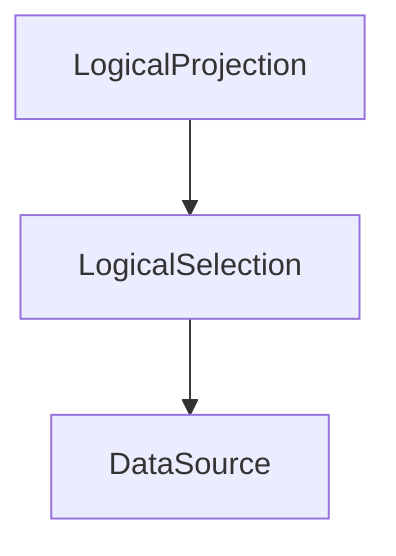

> 本文将粗略地分析TiDB中的ast如何转换成logical plan

------

# TiDB中AST转logical plan过程

该文章主要是涉及到我之前所学习的数据库内核杂谈（七）：数据库优化器（上）中的logical plan的Query rewrite阶段，但是首先需要我们将一个sql的ast先转换成logcial plan；

tidb中的单个logical plan可以理解成是一个logical operator；而ast是一个抽象语法树，那么依靠什么将每个logical operator连接起来呢？可以通过baseLogicalPlan的结构观察出来：
```
type baseLogicalPlan struct {
  basePlan

  taskMap map[string]task
  self    LogicalPlan
  children []LogicalPlan
}
```
每种类型的logical plan都包含了这个基础的baseLogicalPlan(注：baseLogicalPlan是实现LogicalPlan接口的基础数据实现)数据。那么logical operator就是依靠children关联起来，从而形成一个logical operator tree。

现在梳理一下ast转logical plan的过程，我们以tidb的定时sql为例：

    SELECT version, table_id, modify_count, count from mysql.stats_meta where version > 0 order by version

首先这个sql会被翻译成一个ast，大致结构如下：
```
p sel
*github.com/pingcap/tidb/parser/ast.SelectStmt {
  dmlNode: github.com/pingcap/tidb/parser/ast.dmlNode {
    stmtNode: (*"github.com/pingcap/tidb/parser/ast.stmtNode")(0xc0009d0300),},
  SelectStmtOpts: *github.com/pingcap/tidb/parser/ast.SelectStmtOpts {
    Distinct: false,
    SQLBigResult: false,
    SQLBufferResult: false,
    SQLCache: true,
    SQLSmallResult: false,
    CalcFoundRows: false,
    StraightJoin: false,
    Priority: NoPriority (0),
    TableHints: []*github.com/pingcap/tidb/parser/ast.TableOptimizerHint len: 0, cap: 0, nil,},
  Distinct: false,
  From: *github.com/pingcap/tidb/parser/ast.TableRefsClause {
    node: (*"github.com/pingcap/tidb/parser/ast.node")(0xc0008cab80),
    TableRefs: *(*"github.com/pingcap/tidb/parser/ast.Join")(0xc000093700),},
  Where: github.com/pingcap/tidb/parser/ast.ExprNode(*github.com/pingcap/tidb/parser/ast.BinaryOperationExpr) *{
    exprNode: (*"github.com/pingcap/tidb/parser/ast.exprNode")(0xc0001fe5a0),
    Op: GT (10),
    L: github.com/pingcap/tidb/parser/ast.ExprNode(*github.com/pingcap/tidb/parser/ast.ColumnNameExpr) ...,
    R: github.com/pingcap/tidb/parser/ast.ExprNode(*github.com/pingcap/tidb/types/parser_driver.ValueExpr) ...,},
  Fields: *github.com/pingcap/tidb/parser/ast.FieldList {
    node: (*"github.com/pingcap/tidb/parser/ast.node")(0xc000a5d800),
    Fields: []*github.com/pingcap/tidb/parser/ast.SelectField len: 4, cap: 4, [
      *(*"github.com/pingcap/tidb/parser/ast.SelectField")(0xc000756d80),
      *(*"github.com/pingcap/tidb/parser/ast.SelectField")(0xc000756de0),
      *(*"github.com/pingcap/tidb/parser/ast.SelectField")(0xc000756e40),
      *(*"github.com/pingcap/tidb/parser/ast.SelectField")(0xc000756ea0),
    ],},
  GroupBy: *github.com/pingcap/tidb/parser/ast.GroupByClause nil,
  Having: *github.com/pingcap/tidb/parser/ast.HavingClause nil,
  OrderBy: *github.com/pingcap/tidb/parser/ast.OrderByClause {
    node: (*"github.com/pingcap/tidb/parser/ast.node")(0xc000a5d860),
    Items: []*github.com/pingcap/tidb/parser/ast.ByItem len: 1, cap: 1, [
      *(*"github.com/pingcap/tidb/parser/ast.ByItem")(0xc000a5d830),
    ],
    ForUnion: false,},
  Limit: *github.com/pingcap/tidb/parser/ast.Limit nil,
  TableHints: []*github.com/pingcap/tidb/parser/ast.TableOptimizerHint len: 0, cap: 0, nil,
  IsInBraces: false,}
```
获取到了stmtNode之后，进入buildStmt生成相关的logical plan，需要说明的是这个logical plan是根据ast直接翻译出来的，没有任何的优化；优化会在后面简单阐述。

函数buildSelect就是将sel这个ast转换成LogicalPlan的处理函数
```
func (b *PlanBuilder) buildSelect(ctx context.Context, sel *ast.SelectStmt) (p LogicalPlan, err error) {
  b.pushTableHints(sel.TableHints)
  defer func() {
    // table hints are only visible in the current SELECT statement.
    b.popTableHints()
  }()

  if sel.SelectStmtOpts != nil {
    origin := b.inStraightJoin
    b.inStraightJoin = sel.SelectStmtOpts.StraightJoin
    defer func() { b.inStraightJoin = origin }()
  }

  var (
    aggFuncs                      []*ast.AggregateFuncExpr
    havingMap, orderMap, totalMap map[*ast.AggregateFuncExpr]int
    gbyCols                       []expression.Expression
  )

  // 首先处理stmtNode的From字段
  if sel.From != nil {
    // me: SELECT version, table_id, modify_count, count from mysql.stats_meta where version > 0 order by version
    // 其实From字段中是一个join类型
    p, err = b.buildResultSetNode(ctx, sel.From.TableRefs)
    if err != nil {
      return nil, err
    }
  } else {
    p = b.buildTableDual()
  }

  originalFields := sel.Fields.Fields
  sel.Fields.Fields, err = b.unfoldWildStar(p, sel.Fields.Fields)
  if err != nil {
    return nil, err
  }

  if sel.GroupBy != nil {
    p, gbyCols, err = b.resolveGbyExprs(ctx, p, sel.GroupBy, sel.Fields.Fields)
    if err != nil {
      return nil, err
    }
  }

  // We must resolve having and order by clause before build projection,
  // because when the query is "select a+1 as b from t having sum(b) < 0", we must replace sum(b) to sum(a+1),
  // which only can be done before building projection and extracting Agg functions.
  havingMap, orderMap, err = b.resolveHavingAndOrderBy(sel, p)
  if err != nil {
    return nil, err
  }

  // 处理stmtNode的Where字段
  if sel.Where != nil {
    p, err = b.buildSelection(ctx, p, sel.Where, nil)
    if err != nil {
      return nil, err
    }
  }

  b.handleHelper.popMap()
  b.handleHelper.pushMap(nil)

  hasAgg := b.detectSelectAgg(sel)
  if hasAgg {
    aggFuncs, totalMap = b.extractAggFuncs(sel.Fields.Fields)
    var aggIndexMap map[int]int
    p, aggIndexMap, err = b.buildAggregation(ctx, p, aggFuncs, gbyCols)
    if err != nil {
      return nil, err
    }
    for k, v := range totalMap {
      totalMap[k] = aggIndexMap[v]
    }
  }

  var oldLen int
  p, oldLen, err = b.buildProjection(ctx, p, sel.Fields.Fields, totalMap)
  if err != nil {
    return nil, err
  }

  if sel.Having != nil {
    b.curClause = havingClause
    p, err = b.buildSelection(ctx, p, sel.Having.Expr, havingMap)
    if err != nil {
      return nil, err
    }
  }

  if sel.Distinct {
    p, err = b.buildDistinct(p, oldLen)
    if err != nil {
      return nil, err
    }
  }

  if sel.OrderBy != nil {
    p, err = b.buildSort(ctx, p, sel.OrderBy.Items, orderMap)
    if err != nil {
      return nil, err
    }
  }

  if sel.Limit != nil {
    p, err = b.buildLimit(p, sel.Limit)
    if err != nil {
      return nil, err
    }
  }

  sel.Fields.Fields = originalFields
  if oldLen != p.Schema().Len() {
    proj := LogicalProjection{Exprs: expression.Column2Exprs(p.Schema().Columns[:oldLen])}.Init(b.ctx)
    // proj算子将之前处理logical plan作为自己的children，形成最后的logical plan tree
    proj.SetChildren(p)
    schema := expression.NewSchema(p.Schema().Clone().Columns[:oldLen]...)
    for _, col := range schema.Columns {
      col.UniqueID = b.ctx.GetSessionVars().AllocPlanColumnID()
    }
    proj.names = p.OutputNames()[:oldLen]
    proj.SetSchema(schema)
    return proj, nil
  }

  return p, nil
}
```
针对前面的示例sql来说，这个函数主要做了如下处理：

1. 首先调用buildResultSetNode来处理sel.From字段，该字段涉及到了数据获取的源头(即：mysql.stats_meta)，所以要先处理，得到core.DataSource类型的logical plan；
2. 然后调用buildSelection来处理sel.Where字段，该字段涉及了满足的条件；处理完之后形成了core.LogicalSelection类型的logical plan，特别需要说明的是：需要说明的是第一步中获取到的core.DataSource会在这一步中成为core.LogicalSelection的parent；
3. 最后，根据sel.Fields字段形成了LogicalProjection类型的logical plan并将第2步中的core.LogicalSelection作为了自己的children；

通过上面的基础处理之后，ast就会形成如下图所示的logical operator tree；

<script src='https://unpkg.com/mermaid@7.1.2/dist/mermaid.min.js'></script>
<script>mermaid.initialize({startOnLoad:true});</script>

<div class="mermaid">
graph TD;
  LogicalProjection-->LogicalSelection
  LogicalSelection-->DataSource
</div>
上面就形成了一个最基础的logical plan：首先从表mysql.stats_meta中读取数据，然后再选择满足条件的tuples，最后再将相关的属性字段展示处理；最基础的logical plan可以有很多优化的地方：predicates push down，projections push down等等，这些都可以通过普适的优化方案进行优化；

在planner.core.logicalOptimize函数中就使用了各种普适的logical plan优化方案，通过这种优化可以大概率实现第一层基础优化，相关的优化规则如下：
```
var optRuleList = []logicalOptRule{
  &columnPruner{},
  &buildKeySolver{},
  &aggregationEliminator{},
  &projectionEliminator{},
  &maxMinEliminator{},
  &ppdSolver{},
  &outerJoinEliminator{},
  &aggregationPushDownSolver{},
  &pushDownTopNOptimizer{},
  &joinReOrderSolver{},
}
```
粗略的logical plan生成步骤就大致阐述到这里，我们下一篇再见！
